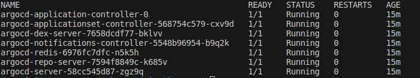

# ArgoCD

Argo CD is a Kubernetes controller, responsible for continuously monitoring all running applications and comparing their live state to the desired state specified in the Git repository. It identifies deployed applications with a live state that deviates from the desired state as OutOfSync. Argo CD reports the deviations and provides visualizations to help developers manually or automatically sync the live state with the desired state. <br/>
Argo CD can automatically apply any change to the desired state in the Git repository to the target environment, ensuring the applications remain in sync.<br/><br/>
ArgoCD has an internal **repository service**. This service caches the Git repository locally and stores the application manifests. The repository server generates Kubernetes manifests and returns them based on inputs such as the repository URL, application path, revisions (i.e., commits, tags, branches), and any template-specific settings (i.e., Helm values, Ksonnet environments, parameters).<br/><br/>
ArgoCD has an **Application Controller**. This controller is a Kubernetes controller that continuously monitors applications, comparing the target state specified in the Git repository with the current state of each application. The applications controller identifies when an application is OutOfSync and can implement corrections where specified. It invokes hooks defined by the user for application lifecycle events such as PreSync, Sync, and PostSync.<br/><br/>
ArgoCD has an **API server**. It is reponsible for letting you interact with Argo CD via the CLI or web UI.<br/><br/>
There are multiple ways to install ArgoCD: by using the manifest files, by using helm chars or by using an operator. Here, I will be using the manifest files to make the installation. 

## ArgoCD Installation 
For this part, I chose to make the documentation in 2 different parts. On for the sake of simplicity and understanding the concepts on minikube, and another one my cluster on virutalbox. Here are my links:
* [Installing ArgoCD on minikube](https://github.com/hereishd/K8S_Tools/tree/main/ArgoCD/with_minikube) 
* [Installing and Customizing ArgoCD on my VirtualBox VM Cluster](https://github.com/hereishd/K8S_Tools/tree/main/ArgoCD/with_virtualbox)
When making your installation, a bunch of components are getting created. I would like to explain these in the next section and strongly recommend that you read this before proceeding with you installation.

## Explaining the components
I will just take a small moment here to explain the use for each pod that will be created on youre install.
<br/>

* **argocd-application-controller-0**: This is the core of ArgoCD. It continuously monitors applications, comparing the target state specified in the Git repository with the current state of our Cluster.
* **argocd-applicationset-controller-...**: Is basically used to generate applications. *(we will go deeper in explaining applications in terms of ArgoCD further on)*
* **argocd-dex-server-...**: Used for the SSO. In case you want to set OIDC or any Auth related configurations with your Identity provider.
* **argocd-notification-controller-...**: This is a new feature. It continuously monitors ArgoCD applications and provide a way to notify users about important changes in the application state.
* **argocd-redis-...**: Responsible of caching the states.
* **argocd-repo-server-...**: Used to communicate with the version control system that we are using to store ou manifests. (ArgoCD only supports GIT based version control systems).
* **argocd-server-...**: Basically, this is the API server of ArgoCD. It is reponsible for letting you interact with Argo CD via the CLI or web UI. (takes all the requests from the users).

## Creating an application from the UI

## Install & Setup ArgoCD CLI
* Install the CLI:<br/>
The instruction to install the ArgoCD CLI can be found on in [the ArgoCD official documentation](https://argo-cd.readthedocs.io/en/stable/cli_installation/). Choose the option that suits you depending on you OS.<br/></br>
* Setup the CLI:<br/>
Let's say you want to check your apps with the CLI, after installing it use this command
```
$ argocd app list
```
You will obtain this error ```FATA[0000] Argo CD server address unspecified```. This is because our CLI is not setup to communicate with our ArgoCD server. We will need to do the same steps than for the UI but for the CLI.<br/>
First we login
```
$ argocd login <URL:PORT>
```
*Here, enter the URL:PORT of your argocd server service to which you want to connect.*<br/><br/>
You will then get prompt to enter your login&password creds. Put the same as you would of used for the UI.<br/>
You can now check all is successfull by querying the argocd server again
```
$ argocd app list
```
<br/>
For more info on the CLI commands, you can refer to [the official documentation](https://argo-cd.readthedocs.io/en/stable/user-guide/commands/argocd/).

## Creating an application from the CLI

## Practical example
It is now time to try ArgoCD.<br/>
For this, ArgoCD itself maintains repositorys with example apps to allow us to practice with ArgoCD. Here is the url: [https://github.com/argoproj/argocd-example-apps](https://github.com/argoproj/argocd-example-apps).<br/>
I will use the guestbook app to start off with. In this repo there is a simple deployment yaml and service yaml
## Ingress Configuration
Since I am using the NGINX Ingress Controller in my cluster, I will configure it with ArgoCD
## References
* [The Official ArgoCD docs](https://argo-cd.readthedocs.io/en/stable/)