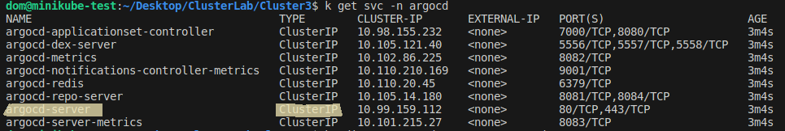
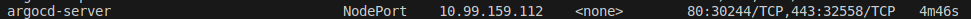

# ArgoCD with minikube

For the sake of simplicity and just to understand the basic concepts, we will install ArgoCD on minikube. We will make use of the argocd project repository for the testing of linking the repos and building our apps.

## Installing ArgoCD on minikube
To install ArgoCD on minikube simply run these commands. I twill create our ```argocd``` namespace and install argocd in the namespace.
```
$ kubectl create namespace argocd
$ kubectl apply -n argocd -f https://raw.githubusercontent.com/argoproj/argo-cd/stable/manifests/install.yaml
```

## Access the UI
We will now check our ArgoCD pods and wait for them to be running.
```
$ kubectl get pods -n argocd -w
```
When all our pods are running it is now time to check our services.
```
$ kubectl get svc -n argocd
```
<br/>
As we can see, our ```argocd-server``` is of type ClusterIP. We nee to edit it to set it's ```type:``` to ```NodePort``` in order for us to be able to access the UI panel.
```
$ kubectl edit svc argocd-server -n argocd
```
We can now check our service to make sure it's type was successfully set to NodePort.
```
$ kubectl get svc -n argocd
```
<br/>
We can now get the url to access our UI
```
$ minikube service argocd-server -n argocd --url
```
<br/>

By accessing the url:port obtained, we are now on ArgoCD's UI login page. The user by default is ```admin```.<br/>
To get you passworde, you will need to decode the ```argocd-initial-admin-secret``` password value.

## Creating the first application